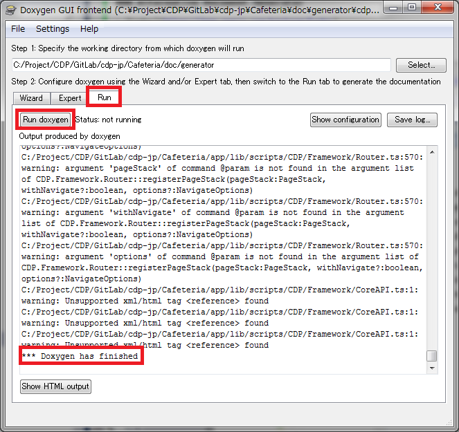
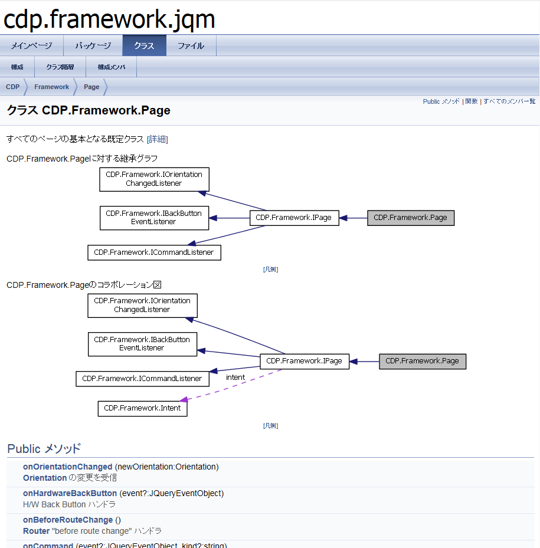
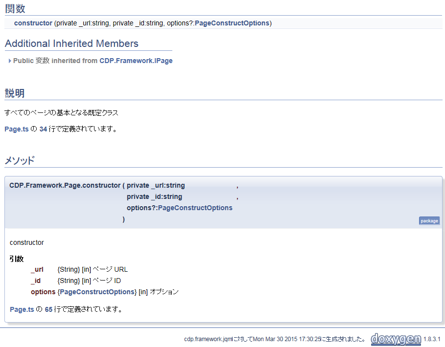

Document Generator by Doxygen
=========

TypeScript 用 [Doxygen](http://www.stack.nl/~dimitri/doxygen/index.html) 設定ファイル

TypeScript を Doxygen を用いて javadoc を生成するための手順を解説

## Doxygenとは

[ウィキペディア](http://ja.wikipedia.org/wiki/Doxygen)より
Doxygen（ドキシジェン）は、C++、C言語、Java、Objective-C、Python、IDL（CORBAおよびマイクロソフト形式）のためのドキュメンテーションジェネレータ


### なぜDoxygenか?
TypeScript 自体の歴史が浅いため、クラス図を出力したり、細かい設定および日本語に対応した満足いくドキュメントジェネレータはまだありません。

Doxygen は TypeScript 用のドキュメントジェネレータではないが、強力なフィルタ機能を利用して一度内部で Java もどきに整形することで、
ある程度役に立つドキュメントが生成可能です。

今後は定期的に、成熟した TypeScript ドキュメントジェネレータと Doxygen のドキュメントを評価していくつもりです。

### Alternative Document Generator

- [tsdoc](https://www.npmjs.com/package/tsdoc)
- [typedoc](http://n0n4m3.codingcorner.net/?p=28871)


## Doxygen を用いてドキュメント生成するための設定 (Windows PC)

- [Doxygen のインストール](http://www.stack.nl/~dimitri/doxygen/download.html)

- [graphviz のインストール](http://www.graphviz.org/Download_windows.php)

 v2.30.0 はバグがあり動かないので注意

- html help compiler を環境変数に登録(通常は Visual Studio に付いてくる)

 C:\Program Files\HTML Help Workshop

- .dxy ファイルを Doxywizard に関連付け


## 使い方

- `xxxx.dxy` をダブルクリック (関連付けを行ったと仮定)

- [Run] タブ, [Run doxygen] ボタンをクリック

 `*** Doxygen has finished` と出るまで待機



- `docs/` に、`xxxx.chm` が出力される


## 出力サンプル

完全な API ドキュメントとはなりませんが、それなりにきれいに出力できます。

### クラス図とメソッド一覧



### メソッド説明



### 制限事項

以下の項目は2015/03/30 時点で未対応です。

    static method
    get/set 後以降に現れるメソッドの解釈が不定
    enum 変数


### ヒント: .chm が開けないときは?

ファイルに対して[右クリック][プロパティ][ブロックの解除]を実行します。


## JavaDoc コメントの書き方

### doxygen / JSDoc のハイブリット方式

```javascript
◎クラス/インターフェイスコメント
/**
 * @class Dialog  * @brief 汎用ダイアログクラス
 *        jQM の popup widget によって実装
 */

◎メソッドコメント
/**
 * 表示
 * 表示をして始めて DOM が有効になる。
 *
 * @param options {DialogOptions} [in] オプション (src は無視される)
 * @return ダイアログの jQuery オブジェクト
 */
public show(options?: DialogOptions): JQuery {
    :
}
```

### doxygen 省略形式

```javascript
◎クラス/インターフェイスコメント
//! @interface ScrollPos interface ScrollPos {
    :
}

◎変数コメント
private _provider: MediaProvider = null; //!< 外部より渡される MediaProvier インスタンスを保持
    
◎メソッドコメント
//! 現在 active なダイアログとして登録する
private static register(dialog: Dialog): void {
}
```

### 日英両対応

```javascript
◎クラス/インターフェイスコメント
/**
 * \~english
 * @class Router
 * @brief Router class for adjusting jQueryMobile functions and Backbone.Router functions.
 *        Even if Backbone.Router does not start routing, natigate() method works good with jQM framework.
 *
 * \~japanese
 * @class Router
 * @brief jQueryMobile と Backbone.Router を調停する Router クラス
 *        ルーティングを開始していない場合にも、navigate() は jQM フレームワークを使用して機能する。
 */
class Router {
    :
}

◎メソッドコメント
/**
 * \~english
 * URL navigation.
 *
 * @param url        {String}          [in] set a navigate URL. (relative path / absolute path / fragment)
 * @param transition {String}          [in] set a transition string (optional)
 * @param reverse    {Boolean}         [in] set a direction string for transition. true:reverse / false:nomal (optional)
 * @param options    {NavigateOptions} [in] set a options object for Backbone.Router.navigate(). (optional)
 *
 * \~japanese
 * URL遷移
 *
 * @param url        {String}          [in] 遷移 URL を指定 (相対パス/絶対パス/フラグメント)
 * @param transition {String}          [in] transition に使用する effect を指定 (任意)
 * @param reverse    {Boolean}         [in] transition に使用する direction を指定 true:reverse/false:通常 (任意)
 * @param options    {NavigateOptions} [in] Backbone.Router.navigate() に渡されるオプション (任意)
 */
static navigate(url: string, transition?: string, reverse?: boolean, options?: NavigateOptions): void;
```
